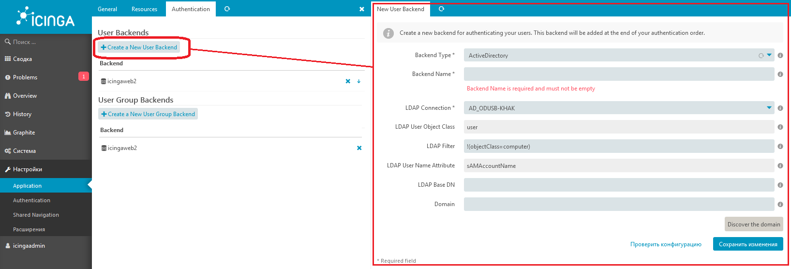
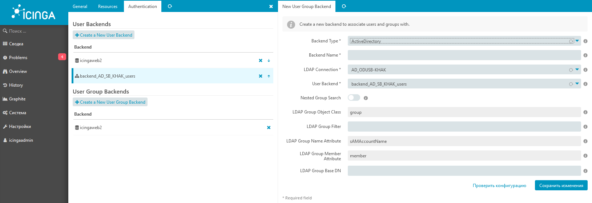

Настройка ПО Icinga
===================

Здесь описаны действия, необходимые для настройки Icinga.

Здесь описываем настройку групп и учётных записей для Icinga, а также возможность добавления исключений событий.
Настраиваем логины и пароли локальных УЗ на сервере ICINGA, а также добавляем доенные УЗ в доменные группы созданные заранее специалистом ОДУ Сибири для каждого Филиала. Отдельно УЗ для VMWARE.

Учётные записи для Icinga
-------------------------

.. _icinga-web-user-authorization:

Авторизация пользователей в Icinga Web
^^^^^^^^^^^^^^^^^^^^^^^^^^^^^^^^^^^^^^

Веб-интерфейс Icinga позволяет использовать для авторизации доменные учётные записи. Для включения доменной авторизации в настройках Icinga необходимо прописать учётную запись с правами на чтение информации из AD. 

Кроме учетной записи, необходимо создать группу **icinga_RDU-users** (**RDU** замените сокращенным названием своего филиала). В эту группу добавьте пользователей, которые будут работать c Icinga. 

Мониторинг серверов с ОС Windows (AD memeber)
^^^^^^^^^^^^^^^^^^^^^^^^^^^^^^^^^^^^^^^^^^^^^

Для мониторинга серверов с ОС Windows, входящих в домен AD рекомендуется использовать доменную учётную запись. При включении данной доменной учётной записи в группу Domain Admins дополнительная настройка серверов не требуется. При желании можно избежать использования учётной записи с правами Domain Admins, для этого на каждом сервере настроить права по `инструкции <_static/Monitoring-Windows-Using-WMI-and-Nagios-XI.pdf>`_. 

Имя учётной записи и пароль необходимо прописать в файле ``/etc/icinga2/constants.conf``, в параметры ``GlobalWmiPlusUser`` и ``GlobalWmiPlusPass``. После внесения новых значений, необходимо перезапустить Icinga командой ``systemctl restart icinga2``.

Мониторинг серверов с ОС Windows (standalone)
^^^^^^^^^^^^^^^^^^^^^^^^^^^^^^^^^^^^^^^^^^^^^

Для мониторинга серверов с ОС Windows, не входящих в домен AD необходимо создать локальную учётную запись на каждом сервере (имя учётной записи и пароль должны быть одинаковы на всех серверах). При включении данной доменной учётной записи в локальную группу Administrators дополнительная настройка серверов не требуется. 

.. warning:: Предоставление прав локального администратора не желательно. Вместо этого, рекомендуется настроить права для учётной записи по `инструкции <_static/Monitoring-Windows-Using-WMI-and-Nagios-XI.pdf>`_. 

Имя учётной записи и пароль необходимо прописать в файле ``/etc/icinga2/constants.conf``, в параметры ``LocalWmiUser`` и ``LocalWmiPass``. После внесения новых значений, необходимо перезапустить Icinga командой ``systemctl restart icinga2``.

Мониторинг VMWARE
^^^^^^^^^^^^^^^^^^

Для мониторинга vCenter серверов и серверов ESXi необходимо создать учётную запись с правами только для чтения.

Имя учётной записи и пароль необходимо прописать в файле ``/etc/icinga2/constants.conf``, в параметры ``Global_vmware_username`` и ``Global_vmware_password``. После внесения новых значений, необходимо перезапустить Icinga командой ``systemctl restart icinga2``.

Интеграция Icinga Web и AD
--------------------------

.. _icinga-create-resource:

Создание ресурса
^^^^^^^^^^^^^^^^

Войдите в веб интерфейс Icinga с помощью учётной записи icingaadmin (пароль для учётной записи предоставляется вместе шаблоном ВМ). В меню откройте раздел ``Настройки->Application`` и выберите вкладку ``Resources``. После нажатия на кнопку ``Create a New Resource`` откроется форма для заполнения данных.

Заполните форму. ``Тип ресурса`` выберите **LDAP**, ``Название ресурса`` для однотипности с другими филиалами сделайте **AD_ODUSB-RDU** ( **RDU** замените сокращенным названием своего филиала ). Поле ``Узел`` содержит имена контроллеров домена перечисленных через пробел (желательно ввести несколько для обеспечения отказоустойчивости). Поля ``Порт`` и ``Encryption`` оставьте со значениями по умолчанию. Поле ``Root DN`` для нашего домена **DC=ODUSB,DC=SO**. В поле ``Bind DN`` пропишите атрибут **distinguished name** учётной записи AD созданной для Icinga, в поле ``Bind Password`` её пароль. После заполнения данных нажмите ``Проверить конфигурацию`` и при отсутствии ошибок, сохраните созданный ресурс.

.. _icinga-create-user-backend:

Создание User Backend
^^^^^^^^^^^^^^^^^^^^^

В меню откройте раздел ``Настройки->Application`` и выберите вкладку ``Authentication``. После нажатия на ссылку ``Create a New User Backend`` откроется форма для заполнения данных.

Заполните форму. В поле ``Backend Type`` укажите тип **ActiveDirectory**, ``Backend Name`` для однотипности с другими филиалами сделайте **backend_AD_SB_RDU_users** ( **RDU** замените сокращенным названием своего филиала ). В поле ``LDAP Connection`` автоматически пропишется ресурс типа LDAP (созданный ранее в пункте :ref:`icinga-create-resource`), а в поле ``LDAP User Object Class`` значение **user**. В поле ``LDAP Filter`` прописываем  **memberOf=DN-группы** (вместо **DN-группы** Вам необходимо указать атрибут distinguishedName группы, созданной ранее в пункте :ref:`icinga-web-user-authorization` ). Значание в поле ``LDAP User Name Attribute`` по умолчанию равно **sAMAccountName**, оставьте его без изменений. Поле ``LDAP Base DN`` оставьте пустым. В поле `Domain` пропишите  имя нашего домена **ODUSB.SO**.

Создание Group Backend
^^^^^^^^^^^^^^^^^^^^^^

В меню откройте раздел ``Настройки->Application`` и выберите вкладку ``Authentication``. После нажатия на ссылку ``Create a New User Group Backend`` откроется форма для заполнения данных.

Заполните форму. В поле ``Backend Type`` укажите тип тип **ActiveDirectory**, ``Backend Name`` для однотипности с другими филиалами сделайте **backend_AD_SB_RDU_groups** ( **RDU** замените сокращенным названием своего филиала ).  В поле ``LDAP Connection`` автоматически пропишется ресурс типа LDAP (созданный ранее в пункте :ref:`icinga-create-resource`), а в поле ``User Backend`` пропишется пользовательский backend, созданный в предыдущем пункте :ref:`icinga-create-user-backend`. 

Прочие настройки
----------------

После заполннения тэгов (синтаксис описан в другом разделе) для объектов (ИТ-активов) в ЕСМ, необходимо проверить взаимодействие экземпляра РДУ с ОДУ Сибири.
Веб-интерфейс и доступ к нему осуществляет администратор ICINGA РДУ и ОДУ.
