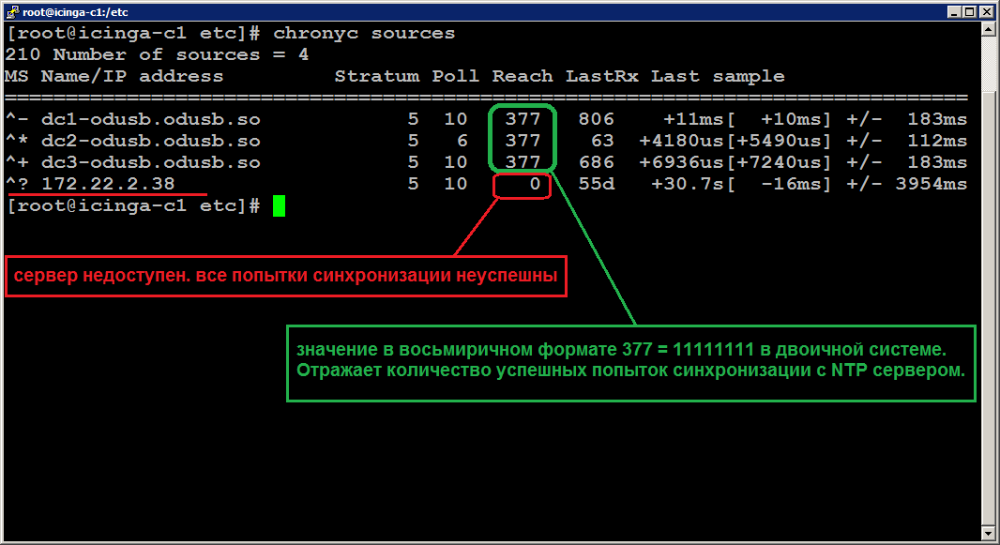

==========================
Начальная настройка Icinga
==========================

Здесь описаны действия, необходимые для настройки Icinga.

Настройка ВМ
------------

Для каждого филиала подготовлен шаблон с виртуальной машиной icinga-e1-**RDU** (**RDU** соответствует сокращенному названию вашего филиала). Полученый шаблон виртуальной машины необходимо импортировать на ДПВ. После загрузки шаблона, у созданной ВМ желательно удалить сетевой адаптер и добавить новый типа VMXNET3 (новый сетевой адаптер будет иметь mac адрес из диапазона выделенного вашему vCenter серверу).

В шаблоне виртуальной машины указаны системные ресурсы - 4 vCPU, RAM 4 GB, HDD 100 GB. При наличии технической возможности желательно удвоить число ядер процессора и объём оперативной памяти.

Настройка ОС
------------

Перед настройкой ОС, Вам необходимо выделить ip адрес для нового сервера. На DNS сервере Филиала, интегрированном в AD, пропишите записи в прямую и обратную зону ( доменное имя сервера и выделенный ему ip адрес). 

.. note:: Внимание! После редактирования записей на DNS сервере филиала, созданные изменения станут доступными в ОДУ только после выполнения репликации AD.

После включения ВМ откройте консоль и войдите в ОС под учётной записью root (пароль предоставляется вместе с шаблоном). Пропишите IP адрес и адреса DNS серверов в файле ``/etc/sysconfig/network-scripts/ifcfg-ens192``.

.. tip:: Для навигации по файловой системе и редактирования файлов рекомендуется использовать файловый менеджер "Midnight Commander" (для его запуска используйте команду **mc**).

Для обеспечения точного времени на сервере установлена программа `Chrony <https://chrony.tuxfamily.org/>`_. Пропишите адреса контроллеров домена филиала в файл  ``/etc/chrony.conf`` и перезапустите службу времени командой ``systemctl restart chronyd``. Проверить работу службы времени можно командой ``chronyc sources`` (при правильной настройке все серверы синхронизации должны быть доступны).

Настройка ПО Icinga
-------------------

Здесь описываем настройку групп и учётных записей для Icinga, а также возможность добавления исключений событий.
Настраиваем логины и пароли локальных УЗ на сервере ICINGA, а также добавляем доенные УЗ в доменные группы созданные заранее специалистом ОДУ Сибири для каждого Филиала. Отдельно УЗ для VMWARE.

Учётная запись для мониторинга серверов с ОС Windows (AD memeber)
^^^^^^^^^^^^^^^^^^^^^^^^^^^^^^^^^^^^^^^^^^^^^^^^^^^^^^^^^^^^^^^^^

Для мониторинга серверов с ОС Windows, входящих в домен AD рекомендуется использовать доменную учётную запись. При включении данной доменной учётной записи в группу Domain Admins дополнительная настройка серверов не требуется. При желании можно избежать использования учётной записи с правами Domain Admins, для этого на каждом сервере настроить права по `инструкции <_static/Monitoring-Windows-Using-WMI-and-Nagios-XI.pdf>`_. 

Имя учётной записи и пароль необходимо прописать в файле ``/etc/icinga2/constants.conf``, в параметры ``GlobalWmiPlusUser`` и ``GlobalWmiPlusPass``. После внесения новых значений необходимо перезапустить Icinga командой ``systemctl restart icinga2``.

Учётная запись для мониторинга серверов с ОС Windows (standalone)
^^^^^^^^^^^^^^^^^^^^^^^^^^^^^^^^^^^^^^^^^^^^^^^^^^^^^^^^^^^^^^^^^

Для мониторинга серверов с ОС Windows, не входящих в домен AD необходимо создать локальную учётную запись на каждом сервере. При включении данной доменной учётной записи в локальную группу Administrators дополнительная настройка серверов не требуется. 

.. warning:: Предоставление прав локального администратора не желатьельно. Вместо этого, рекомендуется настроить права для учётной записи по `инструкции <_static/Monitoring-Windows-Using-WMI-and-Nagios-XI.pdf>`_. 

После заполннения тэгов (синтаксис описан в другом разделе) для объектов (ИТ-активов) в ЕСМ, необходимо проверить взаимодействие экземпляра РДУ с ОДУ Сибири.
Веб-интерфейс и доступ к нему осуществляет администратор ICINGA РДУ и ОДУ.
