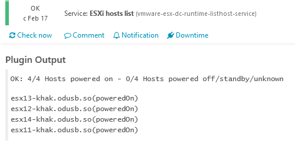
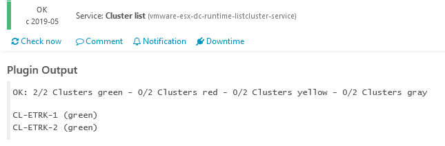
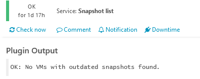
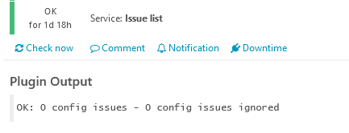
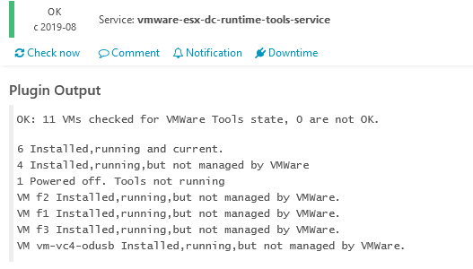
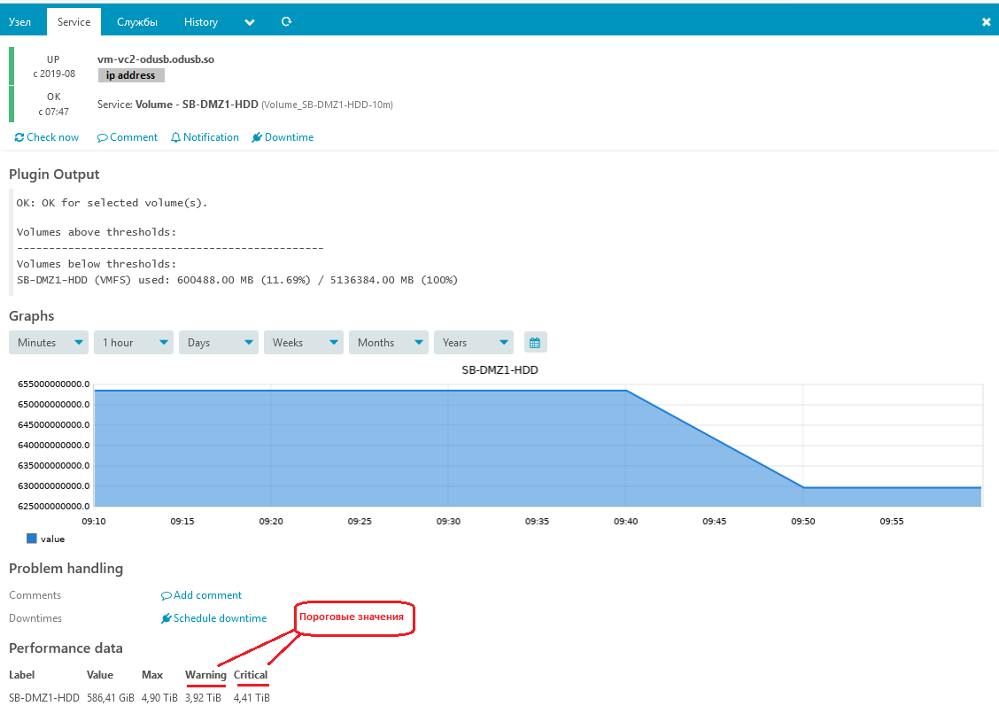
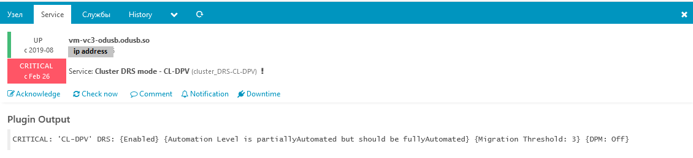

Мониторинг vmware
=================

Перед загрузкой объектов vmware в icinga необходимо создать учётную запись, предоставить права на чтение и прописать параметры этой учётной записи в настройках icinga.

ESXi
----

Базовые сервисы
~~~~~~~~~~~~~~~

На всех серверах ESXi собирается информация о загрузке процессора, памяти и дисковой системы. 

Дополнительные сервисы
~~~~~~~~~~~~~~~~~~~~~~

vCenter
-------

Базовые сервисы
~~~~~~~~~~~~~~~

ESXi host list
""""""""""""""

Список ESXi серверов под управлением vCenter сервера.

Cluster list (Список кластеров)
"""""""""""""""""""""""""""""""

Список кластеров под управлением vCenter сервера.

Snapshot list (Список снапшотов)
""""""""""""""""""""""""""""""""

При наличии с временем хранения более суток, возникает аварийное сообщение.

Issue list
""""""""""

Список обнаруженных проблем.

Vmware tools status (Состояние vmware tools на виртуальных машинах)
"""""""""""""""""""""""""""""""""""""""""""""""""""""""""""""""""""

Информация об актуальности vmware tools установленных в виртуальных машинах. Неактуальные версии vmware tools могут вызывать ошибки в работе механизма DRS.

Дополнительные проверки
~~~~~~~~~~~~~~~~~~~~~~~

Volume (Проверка свободного места на томах vmware)
""""""""""""""""""""""""""""""""""""""""""""""""""

Включается тэгом vc_volume. Ниже приведён тэг включающий мониторинг двух томов (перечисляются через точку с запятой, без пробелов).

.. code-block:: python

    vc_volumes=SB-DMZ1-HDD;SB-DMZ2-HDD

Сервис Volume, созданный тэгом для тома SB-DMZ1-HDD

Cluster DRS mode
""""""""""""""""

Включается тэгом vc_cluster. Служит для проверки режима работы DRS. В штатном режиме должен использоваться режим Fully Automated, но при проведении технических работ режим меняется на Partially Automated (на скриншоте ниже показан такой случай).

