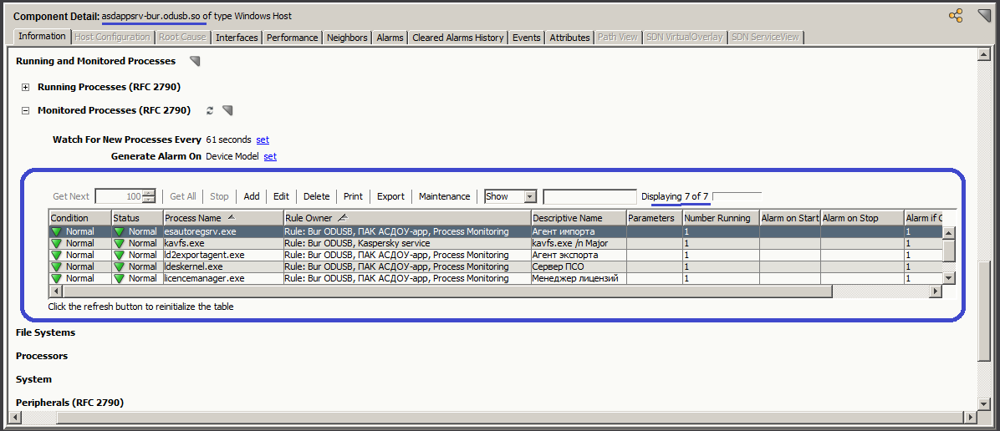

Мониторинг серверов с ОС Windows
================================

На всех серверах с ОС Windows добавленных в Icinga собирается информация о загрузке процессора и памяти. 
Icinga импортиует настройки мониторинга процессов из ЕСМ.

Кроме этого, на серверах с ОС Windows можно включать дополнительные проверки, список которых приведён далее.

Проверка журнала system
-----------------------

Для включения проверки используется тэг **sys_log**. Для изменения настроек выполняемой проверки используется текстовая строка в формате JSON. Пример тэга **sys_log**:

.. code-block:: python
    
    sys_log={"severity":"warning","check_interval":"120","past_hours":"1","notification":{"mail":{"send_recovery":false,"users":["SungurovDV"]}}}

Для повышения наглядности, строку выше можно разбить на несколько строк.

.. code-block:: python
    
    sys_log={
      "severity":"warning",
      "check_interval":"120",
      "past_hours":"1",
      "notification":{
        "mail":{
          "send_recovery":false,
          "users":["SungurovDV"]
        }
      }
    }

Параметр ``severity`` обязательный. Может иметь значения ``error``, ``warning``, ``info``.

Параметр ``check_interval`` определяет частоту выполнения проверки. Целое число определяет количество секунд, для интервала между проверками.

Параметр ``past_hours`` определяет период времени (в часах), за который просматривается журнал system. При ``"past_hours":"2"`` просматриваются сообщения за последние 2 часа. Значение может быть меньше 1 (``"past_hours":"0.25"`` устанавливает фильтр в 15 минут).

Параметр ``notification`` задаёт способ уведомления о возникновении ошибки. На данный момент настроен способ уведомления с помощью почты ``"mail"``.

Параметр ``send_recovery`` может иметь значения ``true``, ``false``. При отключении данного параметра  icinga не будет отправлять уведомление об очищении сервиса от ошибки (когда сообщения с ошибками ушли из диапазона просматриваемых, из-за временного фильтра).

Параметр ``users`` позволяет переопределить список получателей уведомления. По умолчанию (при отсутствии параметра ``users``) уведомления рассылаются сотрудникам, указанным в поле Owner. При заданном списке ``users``, уведомления рассылаются  сотрудникам, указанным в этом списке.

Проверка журнала application
----------------------------

Для включения проверки используется тэг **app_log**. Параметры данного тэга идентичны параметрам тэга **sys_log**.

